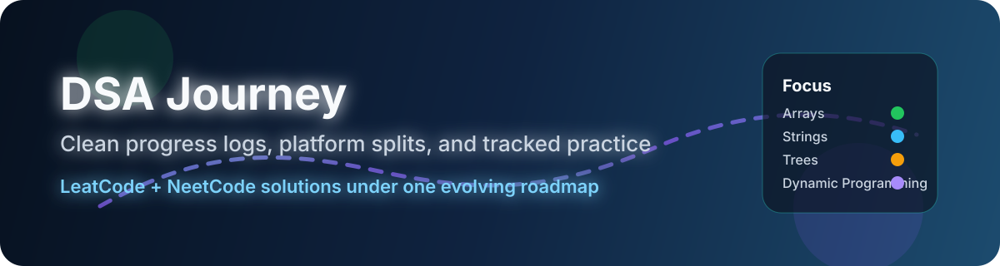

# DSA Journey — Ayuu

  A structured log of problem solving, platform-based solutions, and steady DSA progress.

  
  
  

## Overview

This repository tracks my DSA journey with a clean folder structure and an automated progress tracker. The README is designed to stay readable while still feeling like a live dashboard.

## Highlights

<table>
  <tr>
    <td width="33%">
      <strong>Platform split</strong> 
      Solutions are separated into <code>leatcode</code> and <code>neetcode</code> folders.
    </td>
    <td width="33%">
      <strong>Auto-updated tracker</strong> 
      The progress table is regenerated from the repository structure.
    </td>
    <td width="33%">
      <strong>Visual polish</strong> 
      Animated SVG artwork adds motion without depending on unsupported scripts.
    </td>
  </tr>
</table>

## 🎯 Goals

- Solve 500+ DSA problems
- Master core problem-solving patterns
- Strengthen time and space complexity intuition
- Prepare for top tech internships

## 🧠 Topics Covered

- Arrays
- Strings
- Linked List
- Stack & Queue
- Recursion & Backtracking
- Binary Search
- Trees
- Graphs
- Dynamic Programming
- Sliding Window & Two Pointers

## 🗂️ Folder Structure

- Array & Hashing/
  - Easy-Level/
    - leatcode/
    - neetcode/
- assets/

## 📊 Progress Tracker

| Topic | Problems Solved |
|------|----------------|
| Arrays | 5 |
| Strings | 0 |
| Linked List | 0 |
| Trees | 0 |
| Graphs | 0 |
| Dynamic Programming | 0 |

## 🛠️ Language

- Python (Primary)

## ⭐ Philosophy

> Consistency beats intensity. But when you're late, consistency and intensity must meet.

## 🔥 Connect With Me

*(Will add later)*

